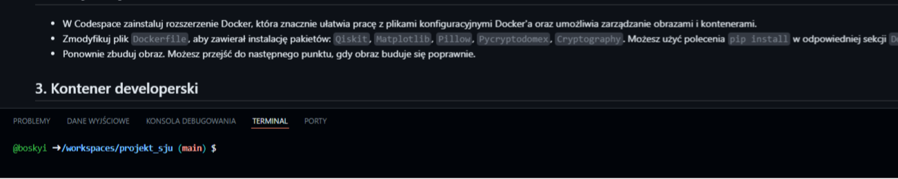
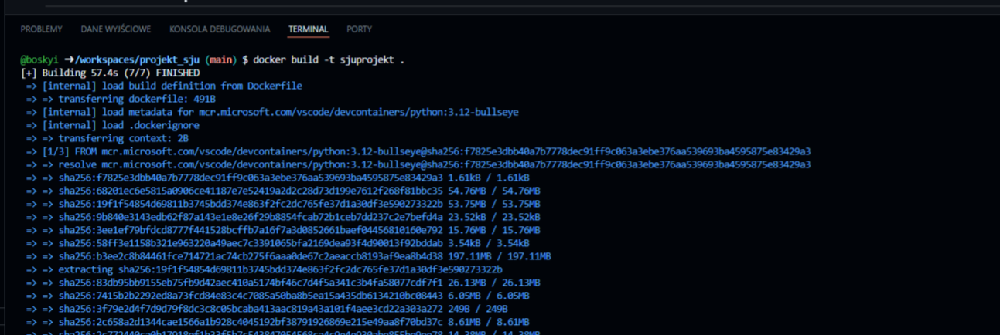
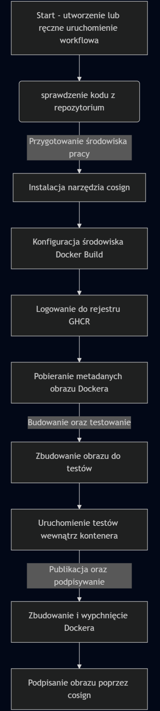
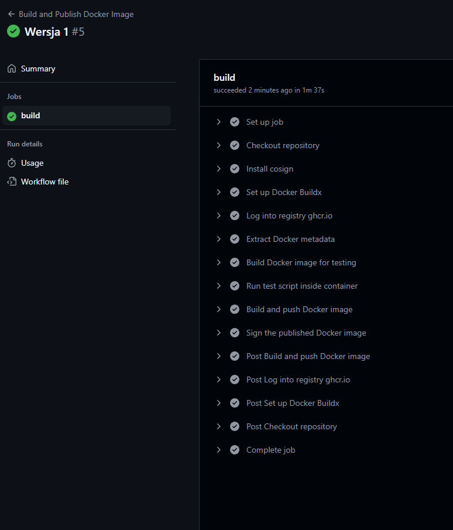
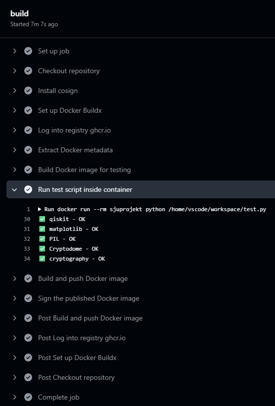

### Raport projektu z przedmiotu Sieć Jako Usługa


##### *Imie i nazwisko:* Patryk Bożek
##### *Kierunek:* Teleinformatyka S2
##### *Semestr:* 1

---

### Przygotowanie środowiska pracy - repozytorium na GitHub

- Wykonać Fork repozytorium na GitHub.
- Otworzenie repozytorium w środowisku Codespaces.





---

### Przygotowanie środowiska pracy - Docker 


- Następnie został zbudowany i uruchomiony kontener zwany Docker'em.



---

### Modyfikowanie pliku Dockerfile

- W pliku Dockerfile należało dodać `Qiskit`, `Cryptography`, `Pillow`, `Matplotlib`, `Pycryptodomex`. Obraz należało zbudować ponownie.

```Docker
RUN pip3 install --disable-pip-version-check --no-cache-dir \
    ipykernel \
    jupyter \
    qiskit \
    matplotlib \
    Pillow \ 
    pycryptodomex \ 
    cryptography
```

---

### Kontener developerski

- Stworzony został plik konfiguracyjny do którego zostały dodane niezbędne rozszerzenia do funkcjonowania.

```json
{
  "workspaceMount": "source=${localWorkspaceFolder},target=/home/vscode/workspace,type=bind,consistency=cached",
  "workspaceFolder": "/home/vscode/workspace",
  "name": "Projekt-SJU",
  "image": "sjuprojekt",
  "customizations": {
    "vscode": {
      "extensions": ["ms-python.python", "ms-toolsai.jupyter"]
    }
  },
  "postCreateCommand": "pip install --no-cache-dir -r requirements.txt && uname -a && python --version && pip --version",
  "remoteUser": "vscode"
}
```

---

### GitHub Actions

- Na tym poziomie należało stworzyć plik `.github/workflows/docker-publish.yml`



---

### Github Actions - działanie pipeline CI/CD

- Należy przeprowadzić sprawdzenie działania workflowu GitHub Actions 



Oto poprawny wykonany workflow



---


### GitHub Actions - zmiana image w kontenerze developerskim

- Gdy wykonał się workflow i otagowaniu nowej wersji obrazu w pliku "JSON" `.devcontainer/devcontainer.json` w sekcji image został zmieniony obraz na nowy wygenerowany poprzez workflow.

```json
...
"image: ghcr.io/boskyi/projekt_sju:v1.0.0"
```
---

### Praca w repozytorium w kontenerze developerskim

- W repozytorim został stworzony katalog `sample` i dodany notatnik Jupyter.
- W celu poprawnego uruchomienia notatnika było trzeba uaktualinić plik `Dockerfile` za pomocą koniecznych bibliotek aby uruchomić oraz dodać nowy tag w repozytorium, który tworzy nową wersję obrazu.
- Kolejno trzeba należało zmienić wersję na najnowszą obrazu w pliku `.devcontainer/devcointainer.json`.
- Zmiany pozwoliły na uruchomienie notatnika w kontenerze developerskim.

---

### Wnioski

**Dzięki projektowi, nauczyłem się pracę z kontenerami Docker w środowisku developerskim. Pozwolił mi na tworzenie i konfigurowanie plików `Dockerfile`, `devcontainer.json` oraz workflowów CI/CD. Dodatkowo, wiem jak zarządzać wersjami obrazów Docker.**

